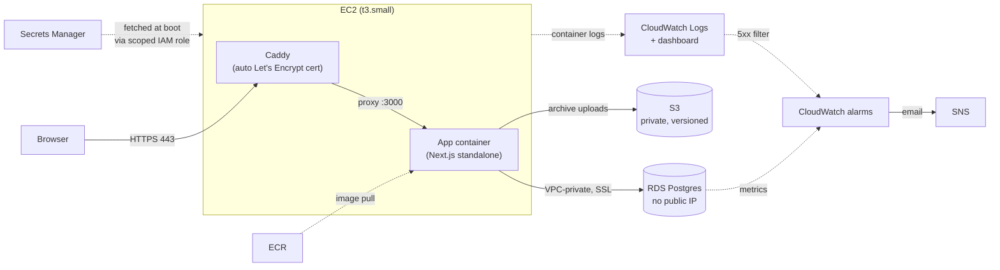

# 11,269 bank credits, one AWS account, and a lot of wrong turns

Reconciliation is the part of finance nobody wants to own. A payment gateway settles a
batch of transactions into your bank account, and somebody has to prove that every rupee
the bank credited matches a specific payout the gateway reported — by amount, by date,
by reference. Most months it's tedious but mechanical. Some months a reference number gets
mangled, two payouts land as one combined credit, or a fee gets deducted from the wrong
side of the ledger, and the tedious job turns into an afternoon of squinting at a bank
statement in Excel.

**Magpie's reconciliation module is built to do that matching automatically — and to know
the difference between "confident" and "guessing."** That second part turned out to be the
whole problem. A wrong match silently corrupts a company's books and nobody notices for
months. An unmatched item just costs a controller one minute of review. So the system has
to be willing to say "I can't tell" far more often than it says "here's the answer."

This is the write-up: what the reconciliation engine actually does, what it took to get it
running live on AWS, and the specific things that fought back — because most of them
weren't the interesting AI problems I expected. They were plain infrastructure, and they
cost more time than the matching logic did.

## The problem, concretely

Ingest a bank statement and a settlement report as CSVs. Every bank credit needs to end up
in one of three states: matched to a settlement, flagged as an exception (something is
genuinely wrong — a chargeback, a duplicate), or escalated for judgment because the
evidence is real but not conclusive. What you can't have is a fourth, silent state: matched
*wrong*.

On a synthetic batch modeled on real gateway failure patterns — mangled UTR references,
split settlements, fees deducted before the credit hits, TDS withheld, refunds netted out
of a later payout — a purely deterministic rule engine gets almost all of it right and gets
stuck on the genuinely ambiguous 5-10%. That's exactly where an LLM earns its keep: not
matching everything, but making the judgment call on the residue, with its answer checked
before it's trusted.

## What actually runs

**A deterministic matcher first.** Exact reference matches, near-miss references, known
fee/TDS/rounding tolerances, split and combined payouts — all of it rule-based, all of it
explainable. Whatever it can't resolve safely gets escalated with the evidence already
attached: the candidate settlements, ranked, with the gap in paise and days between them.

**An adjudication tier behind a validation gate, for what's left.** The model gets a
narrow packet — the bank line, its narration, and up to five ranked candidates — and has to
return structured output: match or decline, which settlement, which failure class, and its
own stated arithmetic. Then a plain TypeScript gate recomputes that arithmetic against the
real records and rejects anything that doesn't tie, anything that names a settlement it
wasn't given, or anything that fails to parse. The model's job is judgment; the gate's job
is to never trust judgment about numbers it can check itself.

On the last run against an 11,274-row synthetic batch (11,269 valid records, 5 rows
deliberately malformed to prove ingestion rejects them):

| Metric | Value |
|---|---|
| Precision | **100%** |
| False-match rate | **0%** |
| Match rate | **98.6%** |
| Escalation rate | **8.1%** (37 of 456 results) |
| Throughput, rules only | **~116,000 records/sec** |

Zero false matches is the number that actually matters here — a system that's fast and 95%
right is worse than one that's slower and never silently wrong. The escalation rate landed
close to the 5% target the design called for; the remaining gap to 100% match rate is six
specific items where the correct settlement was ranked first but the confidence bar wasn't
crossed — which is a live-model run away from closing, not a design problem.

## The stack

| Layer | Choice |
|---|---|
| App | Next.js 16 (App Router), React 19, TypeScript |
| Data | Postgres via Prisma 7 — no bundled query-engine binary, just a `pg` driver adapter |
| Auth | Better Auth (email/password, magic link) |
| Agents | LangGraph "deep agents" — a supervisor with a todo list, two read-only subagents, human-approval gates before any write |
| Adjudication | OpenAI structured output (Responses API), validated by a hand-written gate with no SDK import |
| Deploy | Docker (multi-stage: Bun build → `node:22-slim` runtime), on AWS |

The agent side is worth a sentence: the supervisor that answers "why did gross margin slip
in Q3" has no read tools of its own. Everything it knows comes from delegating to a
model-analyst or data-analyst subagent, specifically so a 24-month sweep across nine
variables fills *that* subagent's context window and not the one holding the final answer.
Any write it wants to make — a new model variable, a chart on a board — halts the whole run
for a human to approve before the tool executes at all. That's not a convention the tool
promises to honor; it's a state the graph cannot leave without a person in it.

## Getting it onto AWS

RDS in a private subnet, an app container and Caddy sharing a Docker network on one EC2
box, a real domain with an auto-renewing certificate, secrets that never touch the launch
config. Straightforward on paper. Almost none of the time went into that diagram — it went
into the seven things below.

## Watching it, and archiving what goes in

Two more AWS services earn their place, and both are small on purpose.

**CloudWatch and SNS.** Both containers log straight to CloudWatch Logs, and Caddy's JSON
access log feeds a metric filter, so every 5xx response becomes a data point. Six alarms
watch it — web CPU, EC2 status checks, RDS CPU, RDS storage, RDS connections, and that 5xx
count — and any of them emails me through SNS. A `magpie-overview` dashboard puts the same
numbers side by side. This is also how I debugged the deploy: when HTTPS did not come up
after the instance swap, I read Caddy's certificate attempts out of CloudWatch instead of
opening a shell on the box.

**S3, for the statements themselves.** Signed-in users can upload a source file on the
review screen. The server ingests it *first* — so a `settlements.csv` sent under the
`bank.csv` label is refused with the missing column named — and only then archives the raw
file to a private, versioned, encrypted bucket. Rejected rows do not block the archive; they
come back as a count and a few lines with reasons, which is the ingestion rule showing up in
the interface.

The check that matters is the round trip. Pushing the batch to S3 and matching straight from
the bucket gives the same answer as matching the files on disk: **419 of 456 results
auto-applied, 6 needing a human, 31 exceptions, ₹1,29,93,999.10 unresolved** — both ways.
Ingestion is a pure function of file contents, so an archive that changed a byte would show
up as a different number. It did not.

Credentials never appear in any of this. The instance role can write to that one bucket and
those log groups and nothing else; on a laptop the same code picks up a named profile.

## What fought back

**1. The error messages actively pointed at the wrong cause.** `Converse` on Bedrock
returned *"your account is currently being verified... normally under 2 hours."* App
Runner returned *"needs a subscription for the service."* Both read like identity checks —
so I waited, then widened IAM, then waited more. Eighteen hours later, the actual answer
was sitting in the Billing console the whole time: the account was on AWS's newer **Free
Plan** tier, and Bedrock and App Runner simply aren't in that tier's service list. No
amount of waiting fixes that — it needs an explicit upgrade to pay-as-you-go. There's no
CLI flag that surfaces this; you have to know to go look at the console banner.

**2. "Private" and "reachable via one allow-listed IP" are not the same thing.** I built
the RDS instance with `PubliclyAccessible: false` and figured I'd open the security group
to my own IP just long enough to run migrations. That does nothing — with no public
accessibility flag set, the instance has no public IP or DNS to route to at all, security
group or not. The actual fix was a **temporary EC2 bastion with no open inbound ports**,
reached over AWS Systems Manager Session Manager and port-forwarded to RDS — private the
entire time, on both ends.

**3. The bastion's own AMI undermined it.** First attempt picked Amazon Linux 2023's
*minimal* image by an unqualified name-pattern match. It boots fine, it's a valid AL2023
box — it just doesn't ship the SSM Agent that the standard image does. Six minutes of `ping
status: None` before checking *which* AMI had actually been selected.

**4. RDS forces SSL; `pg` doesn't negotiate it the way `psql` does.** Direct connections
failed with *"no pg_hba.conf entry ... no encryption."* Adding `sslmode=require` traded that
for a **worse** error: modern `pg` treats `require` as an alias for full certificate
verification, and RDS signs with Amazon's own CA bundle, not a globally trusted root. The
honest fix, given the whole path is already private-VPC-only, was `sslmode=no-verify` —
encrypted, not pinned.

**5. The dumbest one.** This dev machine already runs a local Postgres on port 5432. The
first SSM tunnel silently bound to that instead of forwarding anywhere, and both `psql` and
Prisma "connected" to the wrong database and failed with a *believable* authentication
error — enough to burn real time on the wrong hypothesis (bad password, stale secret)
before running `pg_lsclusters` and finding the actual collision.

**6. The tooling itself refused to let a shortcut through.** The fast way to hand an EC2
instance its runtime secrets is to bake them into the launch script. That's also a real
credential-exposure pattern — anything with `DescribeInstanceAttribute` on the account can
read it back in plaintext — and it got flagged and blocked before the instance ever
launched. The fix was Secrets Manager plus a **least-privilege inline policy scoped to
exactly one secret ARN**, fetched by the instance's own role at boot. More setup, correctly.

**7. DNS resolved everywhere except where it mattered.** The A record checked out cleanly
at the authoritative nameserver and via Google's and Cloudflare's public resolvers within
a minute. The browser kept returning `NXDOMAIN` anyway — on wifi, on mobile data, after
flushing every local cache reachable. A resolver somewhere upstream had cached the
*negative* answer from before the record existed, and negative caching follows the zone's
own policy, not the new record's 60-second TTL. There's no fix but time, and no way to know
whose cache it is.

## If you keep one thing

**The blockers that actually cost hours were never the model or the matching logic — they
were plain infrastructure: a service tier mislabeled as a verification hold, a database
with no public IP at all, an AMI silently missing an agent, and a port already in use.**
Budget real time for that category, not just for the AI part — it's usually smaller than
you think, and infrastructure is usually bigger.

## Try it

Live: **[magpie.akkki.tech](https://magpie.akkki.tech)** — running on the setup above, on a
personal AWS account. `/recon` behind sign-in is the reconciliation review queue described
here.

## Sources

- Numbers throughout are from a live `recon:eval` run against this project's own synthetic
  fixture generator — not estimated, not from documentation.
- AWS behavior (Free Plan service gating, RDS public-accessibility semantics, `pg`'s
  `sslmode` handling, AL2023 image variants) confirmed directly against the AWS CLI and
  console during this deployment, not from prior assumptions.
